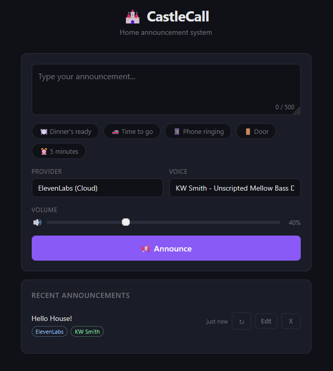

# CastleCall

Home PA / announcement system for Raspberry Pi. Type text in a web UI and play announcements through your speakers.

Built to run alongside AirPlay (`shairport-sync`) on a Pi connected to an amplifier and speakers.

## Example UI



## Features

- Local TTS with [Piper](https://github.com/rhasspy/piper)
- Optional cloud TTS with [ElevenLabs](https://elevenlabs.io/)
- Provider and voice selection in the UI
- Adjustable volume
- Optional delayed announcements (1-60 minutes)
- Replayable announcement history
- Audio caching for faster repeated announcements/replays

## Architecture

```
Phone/Laptop -> Browser -> CastleCall Web UI
                          |
                          v
         POST /api/announce { text, provider, voice, volume }
                          |
                          v
       Provider (Piper or ElevenLabs) generates WAV audio
                          |
                          v
                 aplay/play outputs to Pi audio
                          |
                          v
                     Amp -> Speakers
```

## Prerequisites

- Raspberry Pi (3B+ recommended) with working audio output
- Node.js 18+ installed
- `aplay` available (from `alsa-utils`)

## Quick Start

```bash
git clone <your-repo-url>
cd castlecall
./setup.sh
npm start
```

Open `http://<your-pi-ip>:3000`.

## Manual Installation

### 1. Install Piper TTS

```bash
# Recommended: install Rhasspy Piper binary from releases
wget https://github.com/rhasspy/piper/releases/latest/download/piper_linux_armv7l.tar.gz
tar -xzf piper_linux_armv7l.tar.gz
sudo mkdir -p /usr/local/piper
sudo cp -r piper/* /usr/local/piper/
sudo ln -sf /usr/local/piper/piper /usr/local/bin/piper-tts
```

Set `PIPER_PATH=/usr/local/bin/piper-tts` in `.env`.

### 2. Download a Voice

```bash
mkdir -p ~/.local/share/piper/voices
cd ~/.local/share/piper/voices
wget https://huggingface.co/rhasspy/piper-voices/resolve/main/en/en_GB/jenny_dioco/medium/en_GB-jenny_dioco-medium.onnx
wget https://huggingface.co/rhasspy/piper-voices/resolve/main/en/en_GB/jenny_dioco/medium/en_GB-jenny_dioco-medium.onnx.json
```

### 3. Install CastleCall

```bash
git clone <your-repo-url>
cd castlecall
npm install
cp .env.example .env
```

### 4. Run

```bash
npm start
```

## Configuration

See `.env.example` for all options.

| Variable | Default | Description |
|----------|---------|-------------|
| `PORT` | `3000` | Web server port |
| `PIPER_PATH` | `piper` | Path to piper binary |
| `VOICES_DIR` | `~/.local/share/piper/voices` | Piper voice directory |
| `DEFAULT_VOICE` | `en_GB-jenny_dioco-medium` | Default Piper voice |
| `AUDIO_DEVICE` | `default` | ALSA output device |
| `MAX_TEXT_LENGTH` | `500` | Max announcement length |
| `CACHE_ENABLED` | `true` | Enable WAV cache |
| `CACHE_MAX_FILES` | `100` | Max cached WAV files |
| `TTS_PROVIDER` | `piper` | Default provider: `piper` or `elevenlabs` |
| `ELEVENLABS_API_KEY` | _(empty)_ | ElevenLabs API key |
| `ELEVENLABS_VOICE_ID` | _(empty)_ | Default ElevenLabs voice ID |
| `ELEVENLABS_MODEL_ID` | `eleven_multilingual_v2` | ElevenLabs model |
| `ELEVENLABS_OUTPUT_FORMAT` | `pcm_22050` | ElevenLabs PCM format |
| `ELEVENLABS_TIMEOUT_MS` | `15000` | ElevenLabs timeout (ms) |

Notes:
- `ELEVENLABS_OUTPUT_FORMAT` currently supports `pcm_*` formats only.
- If `TTS_PROVIDER=elevenlabs`, both `ELEVENLABS_API_KEY` and `ELEVENLABS_VOICE_ID` must be set.

## API

### `GET /api/providers`

Returns available providers and the default provider.

### `GET /api/voices?provider=<piper|elevenlabs>`

Returns voices for the selected provider.

### `POST /api/announce`

```json
{
  "text": "Dinner is ready!",
  "provider": "piper",
  "voice": "en_GB-jenny_dioco-medium",
  "volume": 40,
  "delayMinutes": 5
}
```

`delayMinutes` is optional. Use `0` for immediate playback, up to a maximum of `60`.

### `GET /api/history`

Returns recent announcement history.

### `POST /api/replay/:id`

Replays a history entry by ID.

### `GET /api/status`

Returns playback status.

## Running as a Service

Update `castlecall.service` for your user and path, then:

```bash
sudo cp castlecall.service /etc/systemd/system/
sudo systemctl daemon-reload
sudo systemctl enable castlecall
sudo systemctl start castlecall
```

## Tips

- If `sox` is installed, volume scaling uses `play`; otherwise playback falls back to `aplay`.
- Cached files are stored under `/tmp/castlecall-cache`.

## License

[MIT](LICENSE)
